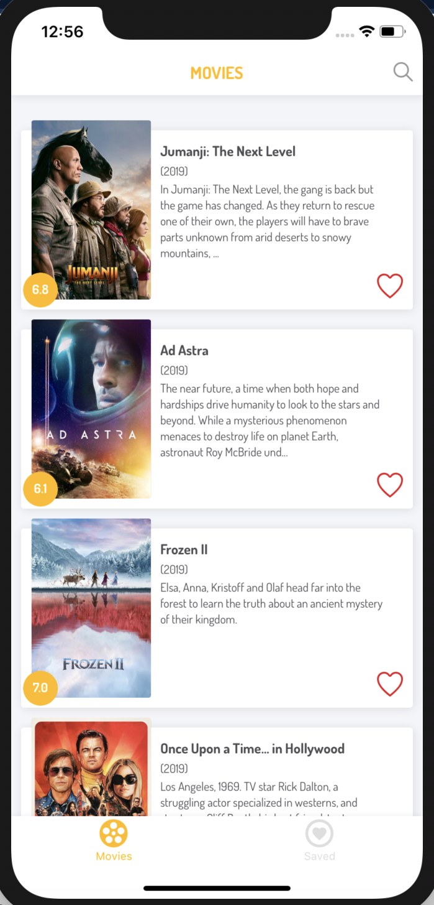
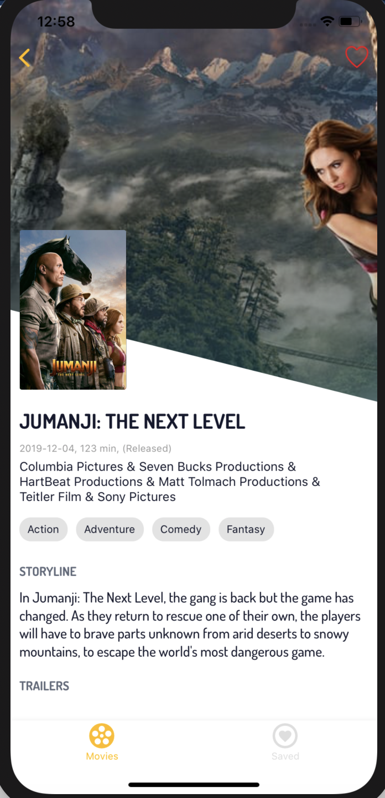

# movie-app

A simple React Native application to view movie details 
Tools used in these projects are AsyncStorage, react navigation and api requests made by fetch.

Home Page                  |  Detail Page
:-------------------------:|:-------------------------:
        |  

All movies and data are downloaded using TMDB.org API.

#Inside the movie-app folder run the following:

expo install
expo start
Press i in the terminal window to start iOS simulator or a for an Android emulator, or use the QR code to run on your own device.